  

 
 

   &nbsp;&nbsp;&nbsp;&nbsp;  &nbsp;&nbsp;&nbsp;&nbsp;  &nbsp;&nbsp;&nbsp;&nbsp; 

 
 

### ❯ Hey there! I'm Roshan 👋

<table>
  <tr>
    <td width="70%">
      <b>Information Science Undergraduate & Full-Stack MERN Developer</b>
        
      I am deeply passionate about crafting high-performance web applications and building multi-user platforms end-to-end.
        
      Currently, I'm focusing my energy on database design to deployment, and leveraging AI developer tools (Google AI Studio, Gemini API) to accelerate delivery. My technical playground revolves around React, Node.js, local AI deployments, and building open-source npm packages!
    </td>
    <td width="30%" align="center">
      
    </td>
  </tr>
</table>

---

## 🛠️ Tech Skills

<h3 align="center">🌐 Frontend Architecture</h3>
<table align="center">
  <tr>
    <td align="center" width="33%">
       
      <b>React.js</b> 
      Component-Based UI Architecture
    </td>
    <td align="center" width="33%">
       
      <b>HTML5</b> 
      Semantic Web Structure
    </td>
    <td align="center" width="33%">
       
      <b>CSS3</b> 
      Modern Responsive Layouts
    </td>
  </tr>
</table>

 
<h3 align="center">⚙️ Backend & Databases</h3>
<table align="center">
  <tr>
    <td align="center" width="25%">
       
      <b>Node.js</b> 
      Event-Driven Server Runtime
    </td>
    <td align="center" width="25%">
       
      <b>Express.js</b> 
      RESTful API Framework
    </td>
    <td align="center" width="25%">
       
      <b>MongoDB</b> 
      Document NoSQL Data Schemas
    </td>
    <td align="center" width="25%">
       
      <b>SQL & DBMS</b> 
      Relational Schemas & Queries
    </td>
  </tr>
  <tr>
    <td align="center" colspan="4">
       
      <b>Firebase</b> 
      Auth & Firestore Cloud Database
    </td>
  </tr>
</table>

 
<h3 align="center">💻 Core Languages</h3>
<table align="center">
  <tr>
    <td align="center" width="25%">
       
      <b>JavaScript</b> 
      ES6+ Asynchronous Logic & APIs
    </td>
    <td align="center" width="25%">
       
      <b>Python</b> 
      Scripting & Automation
    </td>
    <td align="center" width="25%">
       
      <b>Java</b> 
      Object-Oriented Programming
    </td>
    <td align="center" width="25%">
       
      <b>C / C++</b> 
      System Logic & Data Structures
    </td>
  </tr>
</table>

 
<h3 align="center">🧠 Developer Tools & AI</h3>
<table align="center">
  <tr>
    <td align="center" width="25%">
       
      <b>Git & GitHub</b> 
      Branching, PRs & CI/CD Workflows
    </td>
    <td align="center" width="25%">
       
      <b>VS Code</b> 
      IDE & Developer Extensions
    </td>
    <td align="center" width="25%">
      ⭐ 
      <b>Antigravity AI</b> 
      Advanced Agentic Coding
    </td>
    <td align="center" width="25%">
      ✨ 
      <b>Gemini AI & Studio</b> 
      Generative AI Integration
    </td>
  </tr>
  <tr>
    <td align="center" colspan="4">
       
      <b>NPM Publishing</b> 
      Package Management
    </td>
  </tr>
</table>

---

# 📊 GitHub Stats:
 
 

## 🏆 GitHub Trophies

### 🔝 Top Contributed Repo

---

<!-- Proudly created with GPRM ( https://gprm.itsvg.in ) -->

---

## ✍️ Random Dev Quote

  

---

  

